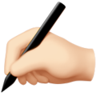
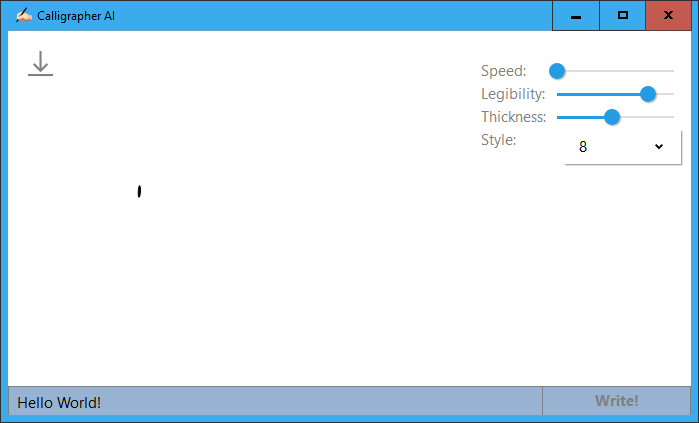

<h1 align="center">
  
    
  Calligrapher AI
   
   
</h1>

<h4 align="center">Handwriting Synthesis with RNNs</h4>
<h5 align="center"><i>Unofficial port of <a href="https://calligrapher.ai">calligrapher.ai</a></i></h5>

<h1 align="center">
  </a>  
</h1>

## Keyboard ⌨️

| Description                 | Key              |
| --------------------------- | ---------------- |
| Synthesize handwriting | <kbd>Enter</kbd> |
| Display the “About” popup   | <kbd>F1</kbd>    |

<h1 align="center">
  <a href="https://github.com/girkovarpa/calligrapher-ai/releases">
  👉 Download for Windows 👈</a>
</h1>

<h4 align="center">
  📧 Send inquiries to girkovarpa@protonmail.com 📪
</h4>

